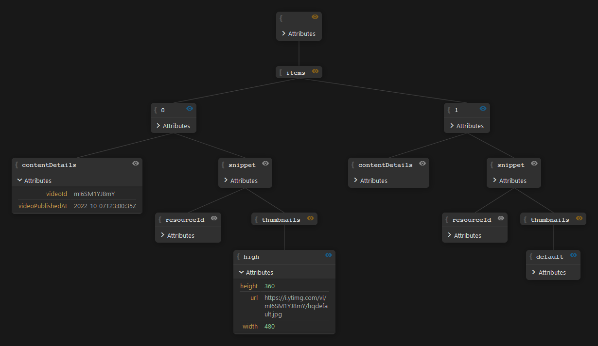

# JSON Tree Preview

**[Try it out here ](anders0nmat.github.io/json-tree-preview/)**

A completely local tree view for JSON and XML files. With ediiting and visibility capabilities if you want to showcase your beautiful JSON file structure.

## Functionality

This is not a feature list but rather an explaination of less intuitive behavior that might occur.

- On XML, if a node has only text in it, this text is used as the value of the node.
- Empty Attributes (as in `{"alive":""}` or `<size absolute="" />`) are treated as Tags and separately shown below the attributes table.
- While editing, your input is not checked for validity and duplicate attributes or named nodes inside indexed containers are allowed. However when exporting you will get an error.
- Currently, exporting will produce the same file type as the imported file. This might change in the future.
